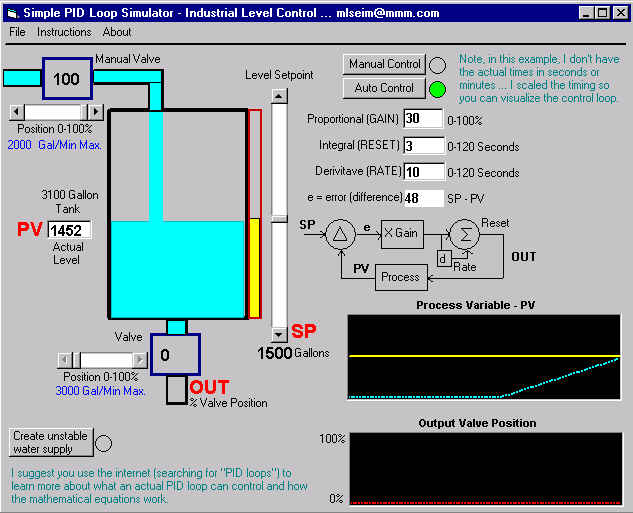



## pid\_loop

### Description

This is a simple PID loop simulator. Proportional, Integral, Derivative algorithm used in the manufacturing industry to control machine processes ... in this example, a water tank with PID loop level control. View the included instructions for more detail. This is for educational use to teach students how computers are used for controlling physical processes. It is simplistic, and models the basic PID algorithm to it's simplest form. You can use this for examples on using sliders, timers, and doing real-time graphing ... of course, you can also learn about PID loop control. Have Fun!
 
### More Info
 

             |
---                |---
**Submitted On**   |2002-01-18 13:58:02
**By**             |[Max Seim](https://github.com/Planet-Source-Code/PSCIndex/blob/master/ByAuthor/max-seim.md)
**Level**          |Intermediate
**User Rating**    |4.7 (52 globes from 11 users)
**Compatibility**  |VB 5\.0, VB 6\.0
**Category**       |[Complete Applications](https://github.com/Planet-Source-Code/PSCIndex/blob/master/ByCategory/complete-applications__1-27.md)
**World**          |[Visual Basic](https://github.com/Planet-Source-Code/PSCIndex/blob/master/ByWorld/visual-basic.md)
**Archive File**   |[pid\_loop496371182002\.zip](https://github.com/Planet-Source-Code/max-seim-pid-loop__1-30929/archive/master.zip)

